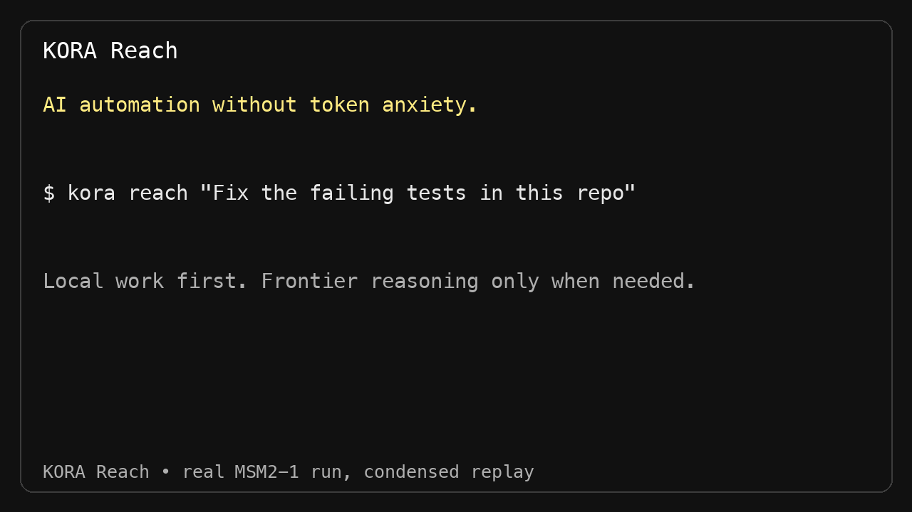

# KORA Reach

**AI automation without token anxiety.**

Use the AI plan and computer you already pay for. KORA keeps routine work local and calls frontier AI only when intelligence is actually needed.

**ChatGPT-first Mac control is the next product direction.** The v0.2 integration
branch adds an authenticated MCP computer node, durable background jobs, browser
and macOS tools, a Reach Console, and an experimental in-chat live-screen viewer.
This is not yet the tagged stable release. See
[ChatGPT-first MCP development and setup](docs/CHATGPT_FIRST_MCP.md).

The v0.1 stable release below remains a standalone CLI.

For the v0.2 preview, clone the feature branch and run the Phase A Mac setup:

    git clone https://github.com/Krako-Labs/kora-reach.git
    cd kora-reach
    git switch feat/chatgpt-mcp-computer-control
    node scripts/setup-mac.mjs

The installer configures a local service and restricted workspace, but does not expose the Mac online. ChatGPT connection still requires secure HTTPS or Tunnel and explicit approval. See [Phase A installation](docs/PHASE_A_INSTALL.md) and [business models](docs/BUSINESS_MODELS.md).

    kora reach "Fix the failing tests in this repo"

KORA Reach is a small, CLI-first local agent. It does not send every step to a model.

The demo above is a condensed replay of a real end-to-end run on MSM2-1: local test failure, one Codex escalation, patch, and independent local verification.

Example result:

    Task completed ✓

    Total KORA actions             6
    Local operations               2
    Deterministic routing          3
    Cached / reused                0
    Frontier escalations           1

    83% handled without frontier-model escalation

**Important:** a frontier escalation is one handoff from KORA to the frontier agent runtime. Codex may perform multiple internal model turns during that handoff. KORA does not pretend this number is a raw provider API-call count.

## Quick start

Requirements:

- Node.js 22.12 or newer
- Git
- Optional for tasks that need frontier reasoning: the official OpenAI Codex CLI, signed in with your ChatGPT account

Install from GitHub:

    npm install -g https://github.com/Krako-Labs/kora-reach.git

For ChatGPT-plan-backed coding escalation:

    npm install -g @openai/codex
    codex

Follow the official ChatGPT sign-in flow. Then:

    cd your-project
    kora reach "Fix the failing tests in this repo"

No OpenAI API key is required for the Codex and ChatGPT-plan path. OpenAI plan usage and limits still apply.

## Three things v0 does

### 1. Coding

    kora reach "Fix the failing tests in this repo"

KORA:

1. detects the repository test command;
2. runs it locally;
3. stops with zero frontier escalation if tests already pass;
4. if tests fail, escalates to Codex in a workspace-write sandbox;
5. reruns the tests locally itself;
6. repeats only if verification still fails.

Supported test detection in v0: npm, pnpm, bun, pytest, Cargo, and Go.

### 2. File automation

    cd ~/Downloads/some-folder
    kora reach "Organize this folder and identify duplicate files"

Hashing and duplicate detection are local. KORA never deletes duplicates.

For safety, v0 will not reorganize files when the target directory is a Git repository. In ordinary folders it groups top-level files into Images, Video, Audio, Documents, Archives, Data, Code, and Other.

### 3. Long-running repair

    kora reach "Keep working on this project until the tests pass" --max-rounds 3

The loop is:

    run tests locally
      |
      +-- pass -> done
      |
      +-- fail -> frontier escalation
                    |
                    +-> run tests locally again
                           |
                           +-> repeat only if still failing

## Why this is KORA

The product rule is simple:

**Inference only when necessary.**

KORA Reach routes work into four buckets:

- **local operations** - shell, filesystem, hashing, tests;
- **deterministic routing** - known task recognition, test discovery, safety gates;
- **cached / reused** - for example reusable file hashes;
- **frontier escalation** - reasoning delegated only when deterministic work cannot finish the task.

The execution report is part of the product, not debug output.

## ChatGPT plan support

As of September 2026, OpenAI officially documents two relevant paths:

1. Codex CLI can be signed in with ChatGPT and uses the user applicable ChatGPT and Codex allowance.
2. Sign in with ChatGPT supports open-source and local apps using eligible ChatGPT plan usage for eligible Responses API requests with explicit user authorization.

KORA Reach v0 chooses the first path because Codex is already a working coding-agent runtime and gets the product public faster. Direct Sign in with ChatGPT is a natural follow-up only if users pull for it.

KORA Reach does not claim unlimited usage, bypass provider limits, call private ChatGPT backend APIs, or expose a generic subscription-to-API proxy.

See docs/RESEARCH.md for official references and the launch decision.

## Local-only behavior

The file demo needs no model.

You can also force coding verification to remain local:

    kora reach "Fix the failing tests in this repo" --frontier none

If tests fail, KORA stops rather than silently invoking a provider.

## Safety

KORA Reach executes local work. v0 deliberately keeps the boundary narrow:

- work is scoped to the current directory or --cwd;
- duplicate files are reported, never deleted;
- Git repositories are protected from file-organization moves;
- frontier coding runs through Codex workspace-write, not unrestricted host access;
- KORA tells the frontier agent not to commit or push;
- KORA stores no provider tokens and logs no credentials.

Review changes before committing them.

## Doctor

    kora doctor

This checks Node, Git, and optional Codex availability.

## Development

    git clone https://github.com/Krako-Labs/kora-reach.git
    cd kora-reach
    npm test
    npm run check

The core has zero runtime npm dependencies.

## What v0 intentionally does not include

No macOS UI. No dashboard. No hosted account system. No billing. No generalized plugin framework. No enterprise console. No multi-agent architecture.

Those are not launch blockers.

## Contributing

The best first contributions are new deterministic handlers that replace an obvious class of unnecessary inference, plus tests proving the behavior.

See CONTRIBUTING.md.

## License

Apache-2.0. See LICENSE.

The optional OpenAI Codex CLI is installed separately and has its own project and license.
